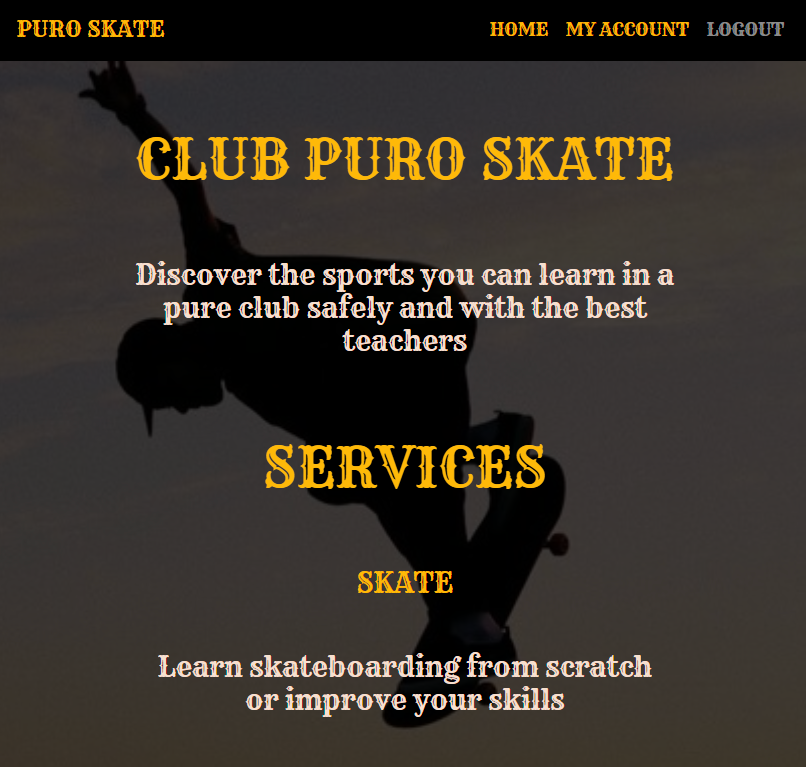
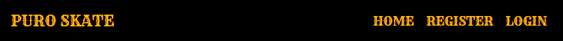
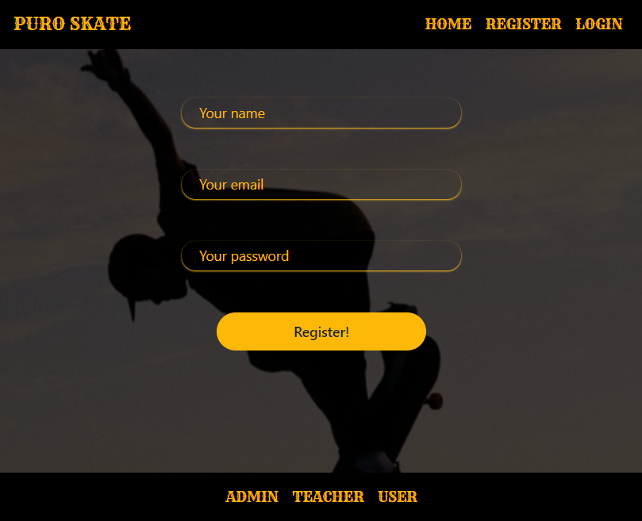
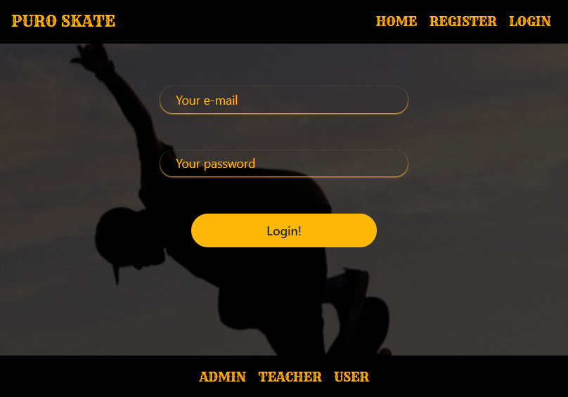
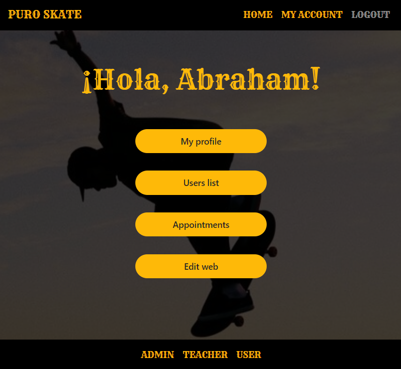
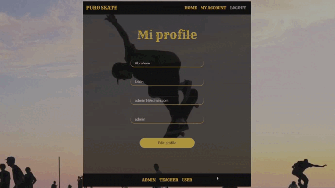
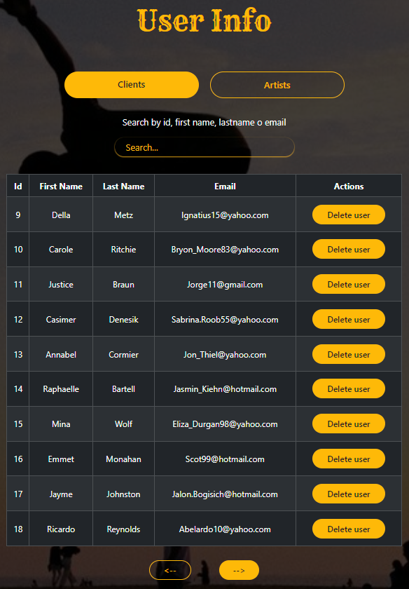
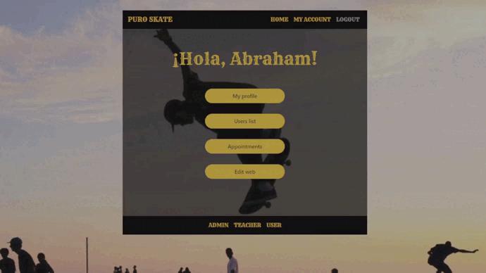

# Skate School Front 

<details>
  <summary>Contenido 📝</summary>
  <ol>
    <li><a href="#objetivo-🎯">Objetivo</a></li>
    <li><a href="#stack">Stack</a></li>
    <li><a href="#deploy-🚀">Deploy</a></li>
    <li><a href="#instalación-en-local">Instalación</a></li>
    <li><a href="#vistas">Vistas</a></li>
    <li><a href="#futuras-funcionalidades">Futuras funcionalidades</a></li>
    <li><a href="#agradecimientos">Agradecimientos</a></li>
    <li><a href="#contacto">Contacto</a></li>
  </ol>
</details>

## Objetivo 🎯

Creación de un front adaptado a una API REST que además de las funciones típicasde un back como hacer login, también permite a los usuarios modificar la imagen de fondo y de los colores de distintos elementos dentro de la página. Estos cambios solo los podrá ver el usuario que ha realizado las modificaciones.
He creado un footer que te permitirá loguearte con el rol que quieras simplemente haciendo click sobre el nombre.


## Stack 🛠️
<div align="center">
<a href="https://www.reactjs.com/">
    
</a>
<a href="https://developer.mozilla.org/es/docs/Web/JavaScript">
    
</a>
 </div>
 <div align="center">
  <a href="https://redux.js.org/" target="_blank">
    
  </a>
</div>
<div align="center">
  <a href="https://developer.mozilla.org/en-US/docs/Web/HTML" target="_blank">
    
  </a>
</div>
<div align="center">
  <a href="https://developer.mozilla.org/en-US/docs/Web/CSS" target="_blank">
    
  </a>
</div>

## Instalación en local
1. Clonar el repositorio
2. ` $ npm install `
3. ``` $ npm run dev ```
4. Puedes usar este back
https://github.com/AbrahamGalvezV/Skate_School_Backend

## Vistas

#### Home

En esta vista encontramos los componentes header, body y footer establecidos en app.jsx y que nos acompañarán en todas las vistas de la página. También encontramos los servicios de los que dispone la escuela.



###### Header

Aquí encontramos los enlaces a las distintas vistas de la página. PURO SKATE también actúa como un botón que te conduce a la vista home.



###### Footer

Aquí encontramos los tres roles con los que podemos acceder a la página, al presionar en uno de ellos nos llevará a la vista my account del rol seleccionado desde donde podremos comprobar los accesos y funciones que tiene cada role dentro de la página sin necesidad de logear.


#### Register



#### Login



#### My Account

En esta vista encontramos los botones que te mostrarán la información a la que tienes acceso según el rol de la cuenta con la que accedas. El texto mostrará tu nombre de usuario.



#### Edit profile

Desde aquí podremos modificar la información de nuestro perfil. Al pulsar en "Edit profile" se desplegará un modal en el que podremos realizar los cambios



#### Users info

A esta vista solo puede acceder el administrador, desde aquí podrá buscar y eliminar usuarios



#### Citas

La información de esta vista cambiará dependiendo del rol con el que accedas.Desde aquí el administrador puede  ver las citas validadas o sin validar, acceder a su información, borrarlas o validarlas. También puede generar una cita.
El usuario puede ver sus citas, eliminarlas o crear otras nuevas.


#### Edit

Dede edit page cualquier usuario puede editar background, color de header/footer, color de letras y botones.  Estos cambios solo los podrá ver el usuario que ha realizado las modificaciones.



## Futuras funcionalidades
⬜ Modificación de fuentes para las letras.
 
⬜ El administrador podrá modificar el texto del header.

⬜ Adaptar la web a dispositivos móviles.

## Agradecimientos:

<a href="https://geekshubsacademy.com/" target="_blank">
  
</a>


## Contacto

<a href="mailto:abraham.galvez.vives@gmail.com">
  
</a>
<a href="https://www.linkedin.com/in/abraham-g%C3%A0lvez-vives-952aa32b2/" target="_blank"></a> 
</p>